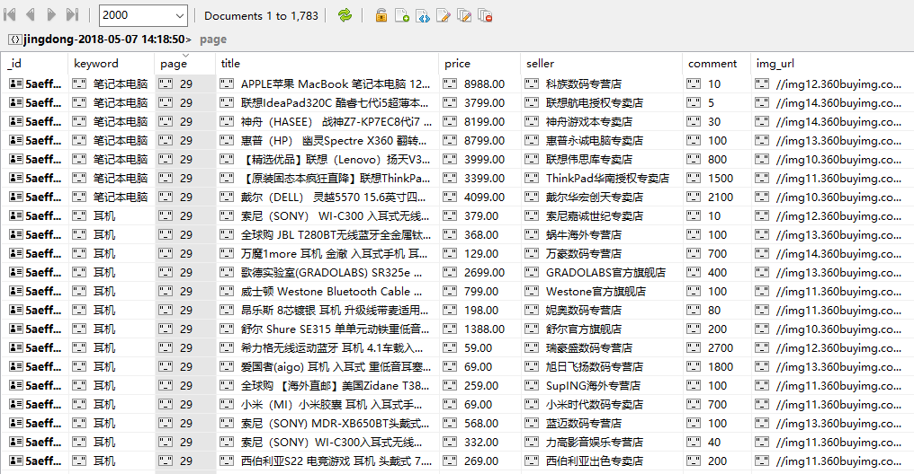

# Scrapy-splash-jingdong
This project provide a way to scrap inforamtion from jd.com based on Scrapy after redering the webpage via Splash.
## 1 Preparation
Make sure to install Python3.6, Docker and MongoDB. 
Make sure to install the following libs: scrapy, scrapy-splash and pymongo. 
Intall and run Splash in command prompt:

    docker run -p 8050:8050 scrapinghub/splash
## 2 Configuration
#### 2.1 Add SPLASH_URL to settings.py

    SPLASH_URL = 'http://localhost:8050'
#### 2.2 Enable SPIDER_MIDDLEWARES and DOWNLOADER_MIDDLEWARES

    SPIDER_MIDDLEWARES = {
        'scrapy_splash.SplashDeduplicateArgsMiddleware': 100,
    }
    
    DOWNLOADER_MIDDLEWARES = {
        'scrapy_splash.SplashCookiesMiddleware': 723,
        'scrapy_splash.SplashMiddleware': 725,
        'scrapy.downloadermiddlewares.httpcompression.HttpCompressionMiddleware': 810,
    }
The details can be achieved from https://github.com/scrapy-plugins/scrapy-splash
#### 2.3 Setup DUPEFILTER_CLASS and HTTPCACHE_STORAGE

    DUPEFILTER_CLASS = 'scrapy_splash.SplashAwareDupeFilter'
    HTTPCACHE_STORAGE = 'scrapy_splash.SplashAwareFSCacheStorage'
#### 2.4 Setup CONCURRENT_REQUESTS

    CONCURRENT_REQUESTS = 5
Reduce CONCURRENT_REQUESTS from 16 (defatul value) to 5 since Splash service can be destroyed under heady load.
## 3 Create SplashRequest
    import scrapy
    from scrapy_splash import SplashRequest
    from urllib.parse import quote
    from scrapy.loader import ItemLoader
    from scrapy_splash_jingdong.items import ProductItem
    from scrapy.loader.processors import Join, MapCompose

    class JingdongSpider(scrapy.Spider):
        name = 'jingdong'
        allowed_domains = ['jd.com']
        scrip = """
        function main(splash)
          splash.images_enabled = false
          assert(splash:wait(splash.args.wait))
          js = string.format("document.querySelector('#J_bottomPage > span.p-skip > input').value=%d; \
               document.querySelector('#J_bottomPage > span.p-skip > a').click()", splash.args.page)
          splash:evaljs(js)
          splash:set_viewport_full()
          assert(splash:wait(splash.args.wait))
          return splash:html()
        end
        """

        def start_requests(self):
            for keyword in self.settings.get('KEYWORDS'):
                for page in range(1, self.settings.get('MAX_PAGE') + 1):
                    url = 'https://search.jd.com/Search?keyword={}&enc=utf-8'.format(quote(keyword))
                    yield SplashRequest(url, self.parse, endpoint='execute', args={
                        'wait': 8,
                        'page': page,
                        'lua_source': self.scrip,
                    }, meta={
                        'keyword': keyword,
                        'page': page,
                    })
SplashRequest is created in jingdong.py. The arguments are passed from Scrapy to Splash to render the web page and then send back respnse to Spider for parsing. Here a Lua Script is defined to realize page loading and page turning. The Lua Script is sent to "execute" endpoint in a "lua_source" argument. To learn more about Splash Script: http://splash.readthedocs.io/en/latest/scripting-tutorial.html
## 4 Running result
The defination of Item and Itempipelines can be found in relative files. The inforamtion of commodities on jd.com is scraped and stored in MongoDB like this:

## 5 Summary
In this project, Splash is used to deal with the webpages dynamically renderd by JavaSacript which are diffulcult to process by Scrapy itself. Splash is called by API which realizes module seperation. Compared to Selenium, Splash do not break the asychronous processing feature of Scrapy, thus resulting in higher scraping efficiency. But at the same time, Splash can not bear heavy load, so load banlance by multiple servers is needed to reach its full potential. 
Note that jd.com is just an example to demonstrate the usage of Splash. Actually commodity inforamtion on jd.com can be scraped without Splash.

